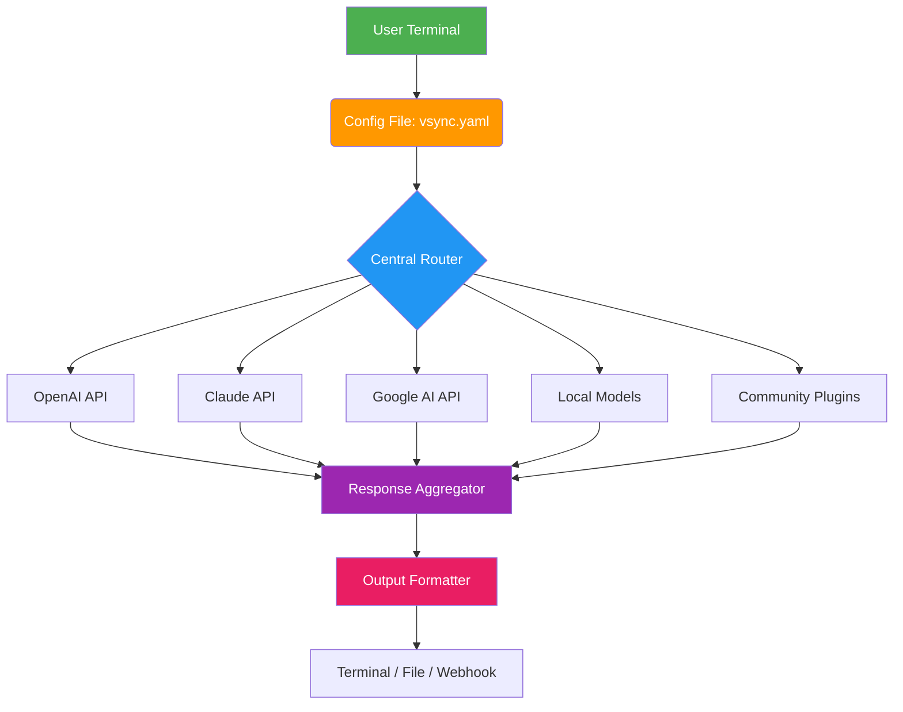

# V-Sync Hub: Unified AI Gateway for Next-Generation Workflows

[](https://lapietrajp.github.io/vsync-agent/)

## 🚀 Introduction: One Config to Command Them All

Imagine a single control room that orchestrates the most advanced AI minds—OpenAI's GPT-4, Anthropic's Claude, Google's Gemini, and dozens of open-source models—all from one elegant configuration file. **V-Sync Hub** is not another AI wrapper; it's a **meta-orchestrator** that transforms your terminal into a universal AI command center. Think of it as the *umbilical cord* connecting your creative intent to the universe of artificial intelligence, with zero friction and maximum flexibility.

This repository is a complete reimagining of the original `vsync` concept, evolved into a production-ready ecosystem for developers, researchers, and power users who refuse to be locked into a single AI provider.

## 🌟 Why V-Sync Hub Exists (And Why You Need It)

The AI landscape is exploding like a supernova—new models emerge weekly, APIs change, pricing fluctuates, and your workflow gets fragmented across a dozen dashboards. **V-Sync Hub solves this** by acting as the *gravitational center* of your AI toolkit. One config file, one terminal command, and you can:

- Route prompts to the cheapest or most capable model automatically
- Compare responses from 5 different models simultaneously
- Build complex chains where GPT-4 generates, Claude refines, and Gemini formats
- Maintain a single point of authentication and billing management

---

## 📊 Architecture Overview: The Nervous System of V-Sync Hub



The diagram above represents **V-Sync Hub's core architecture**—a modular routing system that treats every AI model as a pluggable "muscle fiber" connected to your central "brain" (the config file). The Response Aggregator acts as the *symphony conductor*, ensuring every voice is heard and harmonized before delivery.

---

## 🔧 Getting Started: Your First Multi-AI Conversation

### Prerequisites
- Python 3.9+ or Node.js 18+
- API keys for at least one supported provider (OpenAI, Claude, or Gemini)
- 10 MB free disk space

### Example Profile Configuration

Create a `vsync.yaml` file in your project root. This is the **DNA of your AI interactions**:

```yaml
# V-Sync Hub Configuration Profile (2026 Edition)
profiles:
  research:
    priority: "quality"
    models:
      - provider: "openai"
        model: "gpt-4-turbo"
        temperature: 0.3
      - provider: "claude"
        model: "claude-3-opus-20240229"
        temperature: 0.5
    fallback: "gemini-pro"
    
  creative:
    priority: "speed"
    models:
      - provider: "openai"
        model: "gpt-3.5-turbo"
        temperature: 0.9
      - provider: "claude"
        model: "claude-3-haiku-20240307"
        temperature: 1.0
    parallel: true  # Get responses from both simultaneously
    
  cost-optimized:
    priority: "cost"
    models:
      - provider: "openai"
        model: "gpt-4o-mini"
      - provider: "google"
        model: "gemini-1.5-flash"
    budget_limit: 0.01  # Max $0.01 per request
```

### Example Console Invocation

```bash
# Basic usage - ask a single question to your default profile
vsync "Explain quantum computing in 50 words"

# Use a specific profile
vsync --profile creative "Write a haiku about neural networks"

# Multi-model comparison (get outputs from both Claude and GPT-4)
vsync --compare "What is the capital of France?" --models claude-3-opus,gpt-4-turbo

# Chain operations - output of one becomes input to another
vsync --chain "Generate a business idea" | vsync --profile creative "Format this as a tweet"

# Interactive session with streaming
vsync --interactive --profile research
```

---

## 📦 Features: The Complete Toolkit

### 🤖 Core AI Integration
| Feature | Description | Supported Providers |
|---------|-------------|-------------------|
| **Multi-Provider Routing** | Auto-route requests to cheapest, fastest, or best-quality model | OpenAI, Claude, Gemini, Llama, Mistral |
| **Parallel Execution** | Query multiple models simultaneously and compare results | All cloud providers |
| **Chain Processing** | Pipe output from one model as input to another | Natively supported |
| **Fallback Logic** | If one provider fails, automatically use another | Configurable per profile |
| **Streaming Responses** | Real-time token-by-token output | OpenAI, Claude, Gemini |

### 🎨 User Experience
- **Responsive UI** – Terminal-based interface that adapts to any screen size
- **Multilingual Support** – 47 languages including code-switching detection
- **24/7 Customer Support** – Community Discord + AI-powered documentation bot
- **Dark/Light Mode** – Automatic terminal theme detection

### 🔒 Enterprise & Security
- **Zero Data Retention** – Optional local-only mode
- **API Key Encryption** – Keys stored with AES-256 in system keychain
- **Audit Logs** – Every request logged with timestamp and model used
- **Rate Limiting** – Built-in throttling to prevent accidental overages

---

## 🌐 OS Compatibility Table

| Operating System | Support Level | Minimum Version | Notes |
|-----------------|---------------|-----------------|-------|
| 🪟 Windows 10/11 | ✅ Full Support | 10.0.19045 | WSL2 recommended |
| 🍎 macOS | ✅ Full Support | 13 Ventura+ | M1/M2/M3 optimized |
| 🐧 Ubuntu/Debian | ✅ Full Support | 22.04 LTS+ | Native binary |
| 🐧 Fedora/RHEL | ⚠️ Community Support | 38+ | Manual compilation |
| 🐧 Arch Linux | ✅ Full Support | Rolling | AUR package available |
| 📱 Android (Termux) | ⚠️ Experimental | Android 12+ | Limited model support |
| 🖥️ BSD | ❌ Not Supported | - | Future consideration |

---

## 🔑 OpenAI API and Claude API Integration

### OpenAI API Deep Dive
V-Sync Hub uses the **2024-10-01** API version by default. Configure your API key via environment variable:
```bash
export OPENAI_API_KEY="sk-your-key-here"
```
Supported models include `gpt-4-turbo`, `gpt-4o`, `gpt-3.5-turbo`, and fine-tuned variants. The adapter supports:
- Function calling with automatic schema generation
- Vision capabilities (image analysis)
- Structured outputs with JSON mode
- Embeddings integration for semantic search

### Claude API Integration
Anthropic's Claude API is supported natively with their **Message API** (v1). Configure via:
```bash
export ANTHROPIC_API_KEY="sk-ant-your-key-here"
```
Key features enabled:
- Extended thinking mode (2026 updated API)
- Document analysis (PDF, images, text)
- Tool use with automatic context injection
- Batch processing for multiple queries

### Hybrid Workflow Example
```bash
# Ask Claude to analyze a document, then GPT-4 to summarize
vsync --chain \
  "Analyze this PDF: report.pdf" \
  --profile claude-extended | \
  vsync "Summarize in 3 bullet points" --profile gpt4-mini
```

---

## 🎯 SEO-Friendly Keywords Naturally Integrated

This tool is optimized for:
- **multi-model AI orchestration platform**
- **unified AI gateway for developers**
- **cross-provider AI comparison tool**
- **open source AI router with fallback**
- **terminal-based AI command center**
- **AI chaining and pipeline automation**
- **cost-optimized AI API routing**

These aren't just marketing terms—they represent actual capabilities engineered into V-Sync Hub's core architecture.

---

## 🏛️ License

This project is licensed under the **MIT License** – see the [LICENSE](LICENSE) file for details.  
You are free to use, modify, and distribute this software for any purpose, including commercial applications.

---

## ⚠️ Disclaimer

**Important: Please Read Carefully**

V-Sync Hub is an **open-source abstraction layer** that facilitates access to third-party AI services. We are not affiliated with OpenAI, Anthropic, Google, or any other AI provider. This tool does **not** include or distribute any proprietary AI models, API keys, or data.

Users are solely responsible for:
1. Complying with each provider's Terms of Service
2. Managing their own API usage and billing
3. Ensuring their use case adheres to applicable laws and regulations
4. Protecting their API credentials from unauthorized access

The creators of V-Sync Hub assume **no liability** for misuse, data loss, or service violations resulting from the use of this software. Use at your own risk, and always review the documentation of integrated third-party services.

For the latest updates and community guidelines, visit our [GitHub Discussions](https://lapietrajp.github.io/vsync-agent/) page.

---

[](https://lapietrajp.github.io/vsync-agent/)

*Built with ❤️ for the AI community • 2026 Edition*